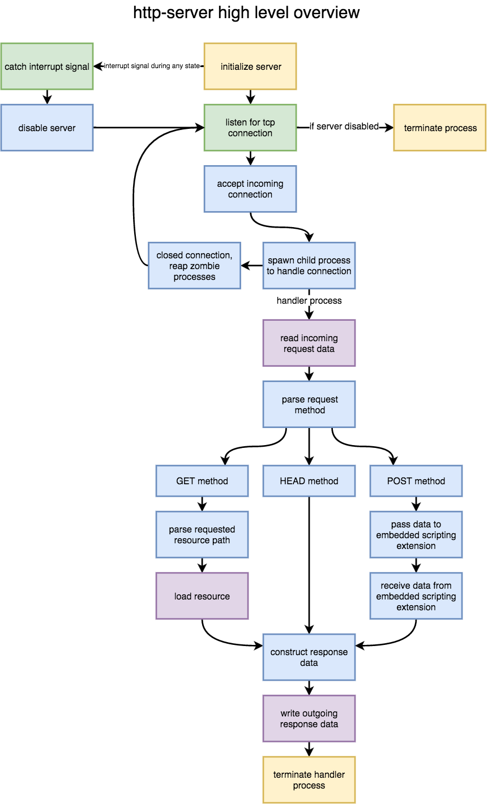

# anji

A simple HTTP server for UNIX-like operating systems (MacOS, Linux, FreeBSD) with no dependencies. 

Serve a site over the network in seconds!

*Disclaimer: This software is still under development. Version 1.0 is coming soon.*

## Installation

A C language compiler is required to build from source.

If you use `git`, clone the repository and run the installation script:

```
git clone https://github.com/aryyya/anji && cd anji && ./install.sh
```

## Usage

To serve a site over the network, invoke `anji` in the site's root directory:

```
anji [port-number]
```

*To serve a site to web browser clients, use port 80.* Ports below 1024 require administrative permissions to use, which you can grant using `sudo` and entering your password (or logging in as the root user):

```
sudo anji 80
```

The site will be accessible via **`http://localhost`** on the host machine, or via the ip address of the host machine for other devices on the same network.

**To stop serving clients and shut down the server, use `ctrl-c` or close the controlling terminal window.**

## Hosting on the Internet

*The site can be made accessible over the internet by configuring your router to forward requests on `TCP port 80` to the local ip address of the host machine.* The site will then be accessible to clients on the internet by visiting your public ip address or a domain name that you have registered.

anji is compatible with common web-hosting services that run Unix/Linux machines (like Heroku).

## Architecture

<p align="center"></p>
